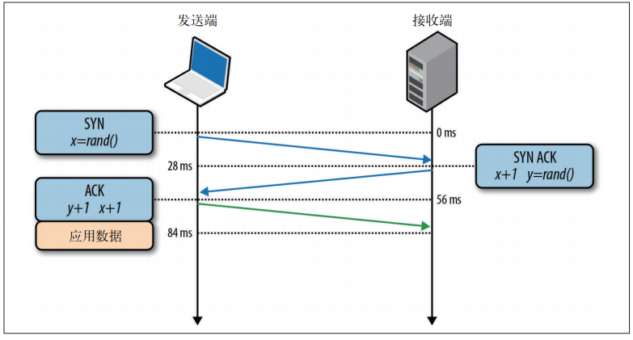

# 网络基础

##
### 1 Traceroute[ˈtreɪsərt]
1、路由跟踪:Unix:traceroute/Window:tracert[ˈtreɪsərt]
* 网络是由无数的计算机和路由器组成一张大网，应用的数据包在发送到服务器之前都要经过层层的路由转发。
而Traceroute是一种常规的网络分析工具，用来定位到目标主机之间的所有路由器
* [Traceroute（路由追踪）的原理及实现](https://www.cnblogs.com/lcword/p/9862539.html)

## TCP构成
### 1 TCP/IP
|- 因特网有两个核心协议：IP 和TCP 。IP ，
|- 即Internet  Protocol [ˈproʊtəkɑːl]（因特网协议），负责联网主机之间的路由选择和寻址；
|- TCP ，即Transmission [trænzˈmɪʃn]  Control  Protocol（传输控制协议），负责在不可靠的传输信道之上提供可靠的抽象层。
|- TCP 负责在不可靠的传输信道之上提供可靠的抽象层，向应用层隐藏了大多数网络通信的复杂细节，比如丢包重发、按序发送、拥塞控制及避免、数据完整，等等。
|- 采用TCP 数据流可以确保发送的所有字节能够完整地被接收到，而且到达客户端的顺序也一样。

#### 2 三次握手（建立连接）、四次挥手（断开连接）
所有TCP 连接一开始都要经过三次握手

####

